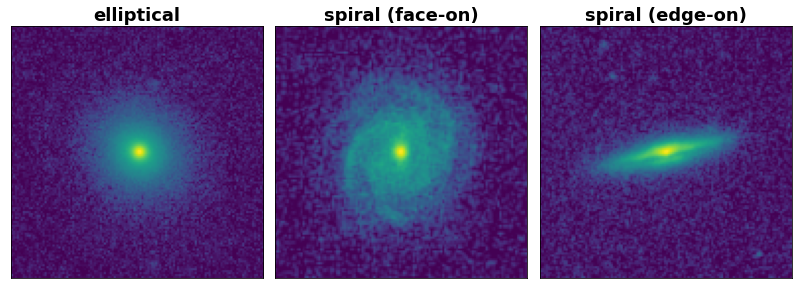

# Morphological stellar mass

A workshop for predicting the total stellar mass of a galaxy, based on a single g-band image.

# Problem formulation

Galaxies are gravitationally bound systems of stars, gas, and dust. They come in a large variety of sizes and shapes, but most of them can be roughly classified in two groups: spiral galaxies and elliptical galaxies. Ellipticals are featureless blobs, whereas spirals are disk galaxies with spiral arms and a central bulge. Here are three example galaxies from our dataset:

To learn more about how galaxies form, we must be able to estimate galaxy properties. An important property is the stellar mass: the total mass of all stars in the galaxy. If there are more stars, both the stellar mass and the total (stellar) light will increase, so the interesting property is the mass-to-light (_M/L_). Typically, this property is estimated by using a series of observations at different wavelengths. If the galaxy is bluer (emits more at shorter wavelengths), it has more young stars, and this results in a lower _M/L_. 

The main question we are interested in here is: **can we estimate the _M/L_ using a single observation, at one wavelength?** Our dataset has images of the g-band (around 475 nm: blue). It is a supervised regression problem. Supervised, since the dataset actually has more observations and thus an accurate ground truth _M/L_. Regression, since the _M/L_ is a continuous variable (typically between 0 and 4).

The reason this single band _M/L_ estimate is possible, is because the image shows us the morphology of the galaxy. Most spiral galaxies have active star formation, and thus a lower _M/L_, whereas ellipticals are often called "red and dead": a high _M/L_. By constructing a machine learning model, we can estimate the _M/L_ from a single band observation.

# Data

The galaxy metadata can be found in `data/metadata/metadata.tsv`. This contains the target _M/L_, as well as some other galaxy properties: the distance to the galaxy, the total g-band luminosity, and the size of the galaxy. The distance (and the galaxy size) require observing a spectrum of the galaxy: it is hence interesting to build a model both with and without distance (and galaxy size). The base model only makes use of the images.

The images have been preprocessed. Some foreground contamination (Milky Way stars) has been removed. The images have been log-scaled (this results in a more clear view of the fainter features). They are all cropped around the center of the galaxy, and then resized (one dataset uses 69x69 pixels, the other 128x128).

At the time of writing, the images are stored as .npy files, which will be downloaded using the morphoml.imgload.load_npy function.

# Getting started

The code should work with any tensorflow 2 version, and further only requires numpy, pandas, and tensorflow_addons. To run the plotting, scipy and matplotlib are also required. To run the notebooks, either jupyter notebook or jupyter lab is required. The requirements.txt file can be used, but care has to be taken to have the right CUDA toolkit version for tensorflow (10.1 should work, but see this [tensorflow-addons chart](https://github.com/tensorflow/addons#python-op-compatibility-matrix)).